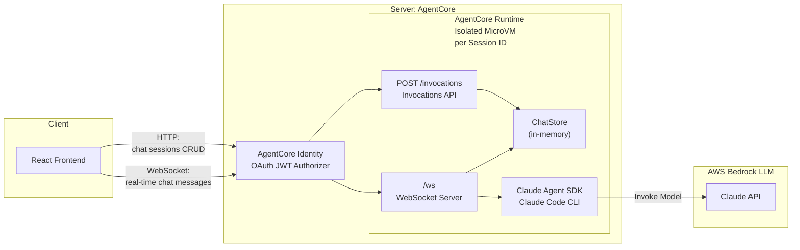

# Simple Chat App

A demo chat application using the Claude Agent SDK with a React frontend, deployed on AWS Bedrock AgentCore Runtime. Modified from [original Anthropics Claude Agent SDK simple-chatapp demo](https://github.com/anthropics/claude-agent-sdk-demos/tree/main/simple-chatapp).


## Original Architecture


## Getting Started

### Prerequisites

- Node.js 20+
- AWS CLI configured with credentials
- Python 3.10+ (for the AgentCore Starter Toolkit; use a virtualenv if needed)

### Deploy

```bash
chmod +x deploy.sh
./deploy.sh
```

This handles everything: AgentCore Runtime setup, Cognito auth, ARM64 container build via CodeBuild (no local Docker), S3 + CloudFront frontend deployment.

### Access

**Production** — open the CloudFront URL printed at the end of deploy (e.g. `https://d33sm1d7ly2wjz.cloudfront.net`). No local server needed.

**Local dev** — for development against the deployed AgentCore backend:
```bash
npm run dev:deployed   # proxy + Vite dev server
# Open http://localhost:5173
```

Sign in with the test credentials printed by `deploy.sh`.

### Tear Down

```bash
./deploy.sh --destroy   # removes CloudFront/S3, AgentCore runtime, Cognito, config files
```

### Architecture

**Production**: CloudFront serves the React app from S3 and routes `/invocations*` (REST) and `/ws*` (WebSocket) to AgentCore. Same-origin eliminates CORS. A CloudFront Function injects the JWT from query params into the `Authorization` header for WebSocket connections.

**Local dev**: Vite proxies `/invocations` and `/ws` to a local bridge (`server/ws-proxy.ts` on port 3001) that forwards to AgentCore with auth headers.

## Production Considerations

This is an example app for demonstration purposes. For production use, consider:

1. **Isolate the Agent SDK** - Resolved. The Agent SDK runs inside an AgentCore Runtime container, isolated from the frontend. AgentCore manages container lifecycle, scaling, and session affinity. Each session gets a dedicated microVM with a configurable idle timeout (default 15 min).

2. **Persistent storage** - Replace the in-memory `ChatStore` with a database. Currently all chats are lost on container restart. Coming soon: **AgentCore Memory** will provide managed persistent storage for agent conversations.

3. **Transcript syncing** - For Agent Sessions to be persisted across container restarts, conversation transcripts need to be synced with external storage. Coming soon: **AgentCore Memory** will handle transcript persistence and restoration automatically.

4. **Authentication** - Add user authentication and authorization. Currently using Cognito test users created by the toolkit. Coming soon: **AgentCore Identity** will provide managed identity and access control for multi-tenant agent applications.

> Items 2-4 will be addressed with AgentCore Memory and AgentCore Identity in an upcoming update.

## Demo


## Security

See [CONTRIBUTING](CONTRIBUTING.md#security-issue-notifications) for more information.

## License

This library is licensed under the MIT-0 License. See the LICENSE file.

