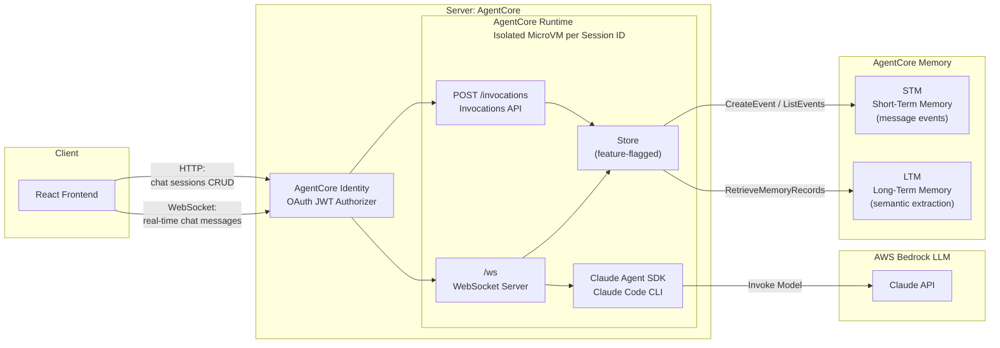

# Simple Chat App

A demo chat application using the Claude Agent SDK with a React frontend, deployed on AWS Bedrock AgentCore Runtime. Modified from [original Anthropics Claude Agent SDK simple-chatapp demo](https://github.com/anthropics/claude-agent-sdk-demos/tree/main/simple-chatapp).


## Original Architecture


## Getting Started

### Prerequisites

- Node.js 20+
- AWS CLI configured with credentials
- Python 3.10+ (for the AgentCore Starter Toolkit; use a virtualenv if needed)

### Deploy

```bash
chmod +x deploy.sh
./deploy.sh
```

This handles everything: AgentCore Runtime setup, Cognito auth, ARM64 container build via CodeBuild (no local Docker), S3 + CloudFront frontend deployment.

### Access

**Production** — open the CloudFront URL printed at the end of deploy (e.g. `https://d33sm1d7ly2wjz.cloudfront.net`). No local server needed.

**Local dev** — for development against the deployed AgentCore backend:
```bash
npm run dev:deployed   # proxy + Vite dev server
# Open http://localhost:5173
```

Sign in with the test credentials printed by `deploy.sh`.

### Tear Down

```bash
./deploy.sh --destroy   # removes CloudFront/S3, AgentCore runtime, Cognito, config files
```

### Architecture

**Production**: CloudFront serves the React app from S3 and routes `/invocations*` (REST) and `/ws*` (WebSocket) to AgentCore. Same-origin eliminates CORS. A CloudFront Function injects the JWT from query params into the `Authorization` header for WebSocket connections.

**Local dev**: Vite proxies `/invocations` and `/ws` to a local bridge (`server/ws-proxy.ts` on port 3001) that forwards to AgentCore with auth headers.

## Production Considerations

1. **Isolate the Agent SDK** - Resolved. The Agent SDK runs inside an AgentCore Runtime container with per-session microVM isolation and a 15-min idle timeout.

2. **Persistent storage** - Resolved. **AgentCore Memory (STM)** replaces the in-memory `ChatStore`. Messages and chat metadata persist across container restarts via the Memory API. Feature-flagged: set `AGENTCORE_MEMORY_ID` to enable, otherwise falls back to in-memory.

3. **Cross-session context** - Resolved. **AgentCore Memory (LTM)** uses a semantic extraction strategy to auto-extract facts from conversations. New chats retrieve relevant context via `RetrieveMemoryRecords` semantic search, so the agent remembers information across sessions.

4. **Bounded context window** - Resolved. Instead of injecting unbounded conversation history into the system prompt, only the last 20 STM turns + top 5 LTM records are included.

5. **Authentication** - Cognito test users via `agentcore identity setup-cognito`. AgentCore validates JWTs at the platform level.

## Demo


## Security

See [CONTRIBUTING](CONTRIBUTING.md#security-issue-notifications) for more information.

## License

This library is licensed under the MIT-0 License. See the LICENSE file.

