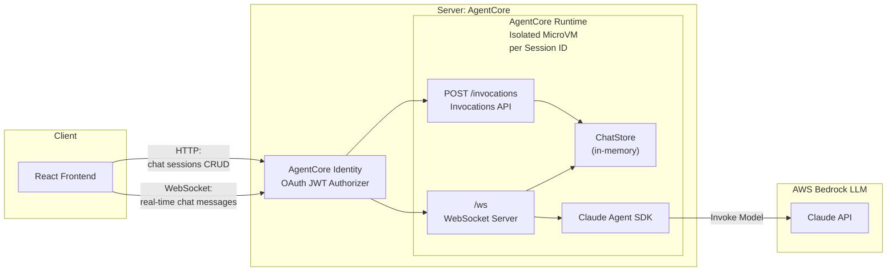

# Simple Chat App

A demo chat application using the Claude Agent SDK with a React frontend, deployed on AWS Bedrock AgentCore Runtime. Modified from [original Anthropics Claude Agent SDK simple-chatapp demo](https://github.com/anthropics/claude-agent-sdk-demos/tree/main/simple-chatapp).


## Original Architecture

## Getting Started

### Prerequisites

- Node.js 20+
- AWS CLI configured with credentials
- Python 3.10+ (for the AgentCore Starter Toolkit; use a virtualenv if needed)

### One-Click Deployment

```bash
# Install dependencies
npm install

# Deploy to AgentCore Runtime (builds container via CodeBuild, sets up Cognito auth)
chmod +x deploy.sh
./deploy.sh
```

The deploy script handles everything:
1. Configures AgentCore Runtime agent
2. Sets up Cognito authentication with test users
3. Configures OAuth JWT authorizer
4. Builds and deploys ARM64 container via CodeBuild (no local Docker required)
5. Generates local config files (`.env`, `client/.env`)

### Running

```bash
# Start the local proxy + frontend
npm run dev:deployed

# Stop all dev processes
npm run dev:stop
```

Open http://localhost:5173 and sign in with the test credentials printed by `deploy.sh`.

Browser traffic is routed through a lightweight local proxy (`server/ws-proxy.ts` on port 3001)
that adds `Authorization` and `X-Amzn-Bedrock-AgentCore-Runtime-Session-Id` headers
before forwarding to AgentCore.

## Production Considerations

This is an example app for demonstration purposes. For production use, consider:

1. **Isolate the Agent SDK** - Resolved. The Agent SDK runs inside an AgentCore Runtime container, isolated from the frontend. AgentCore manages container lifecycle, scaling, and session affinity. Each session gets a dedicated microVM with a configurable idle timeout (default 15 min).

2. **Persistent storage** - Replace the in-memory `ChatStore` with a database. Currently all chats are lost on container restart. Coming soon: **AgentCore Memory** will provide managed persistent storage for agent conversations.

3. **Transcript syncing** - For Agent Sessions to be persisted across container restarts, conversation transcripts need to be synced with external storage. Coming soon: **AgentCore Memory** will handle transcript persistence and restoration automatically.

4. **Authentication** - Add user authentication and authorization. Currently using Cognito test users created by the toolkit. Coming soon: **AgentCore Identity** will provide managed identity and access control for multi-tenant agent applications.

> Items 2-4 will be addressed with AgentCore Memory and AgentCore Identity in an upcoming update.

## Demo

<<<<<<< HEAD
## My Project
=======

>>>>>>> 71ed2bc (update README)

## Security

See [CONTRIBUTING](CONTRIBUTING.md#security-issue-notifications) for more information.

## License

<<<<<<< HEAD
This library is licensed under the MIT-0 License. See the LICENSE file.

=======
This library is licensed under the MIT-0 License. See the LICENSE file.
>>>>>>> 71ed2bc (update README)
